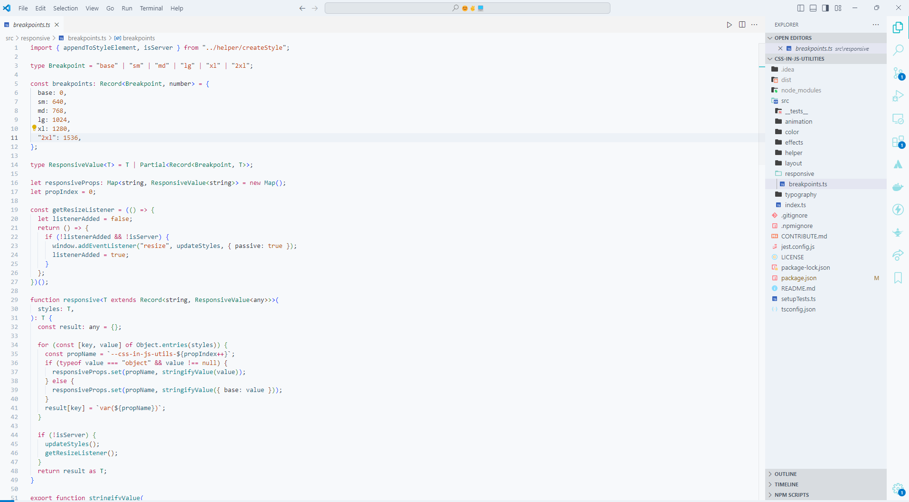

# Crystal Clear Coding Theme


Crystal Clear Coding is a meticulously crafted Visual Studio Code theme designed to enhance your coding experience. With both dark and light variants, it offers a unique, visually appealing environment that makes code reading effortless across all languages.

## Features

- 🌓 Dark and Light themes for all-day coding comfort
- 🎨 Carefully chosen color palette for optimal readability
- 🔍 Enhanced semantic highlighting for easier code comprehension
- 💡 Improved UI elements for better focus and reduced eye strain
- 🖥️ Optimized for long coding sessions

## Screenshots

### Dark Theme


### Light Theme


## Installation

1. Open Visual Studio Code
2. Go to Extensions (Ctrl+Shift+X)
3. Search for "Crystal Clear Coding"
4. Click Install
5. Open the Command Palette (Ctrl+Shift+P)
6. Type "Color Theme" and select "Preferences: Color Theme"
7. Choose either "Crystal Clear Coding - Night" or "Crystal Clear Coding - Day"

## Customization

Crystal Clear Coding is designed to work great out of the box, but you can further customize it to your liking:

1. Open your `settings.json` file
2. Add or modify the following settings:

```json
{
  "workbench.colorCustomizations": {
    "[Crystal Clear Coding - Night]": {
      // Your custom overrides for the dark theme
    },
    "[Crystal Clear Coding - Day]": {
      // Your custom overrides for the light theme
    }
  }
}
```
## Recommended Font
For the best experience, we recommend using a font with programming ligatures. My favorite is Fira Code, but feel free to use any font you prefer.

## Feedback and Contributions
Your feedback is highly appreciated! If you encounter any issues or have suggestions for improvements:

- File an issue on our [GitHub repository](https://github.com/heyameen/crystal-clear-coding-theme/issues)
- Submit a pull request with your proposed changes

## Changelog
See the CHANGELOG.md file for details on each release.

## License
This theme is released under the MIT License.

## Support
If you enjoy this theme, consider:
⭐ Starring the repository on GitHub
🌟 Rating it on the Visual Studio Marketplace
📢 Sharing it with your friends and colleagues

Happy coding with Crystal Clear vision! 🚀